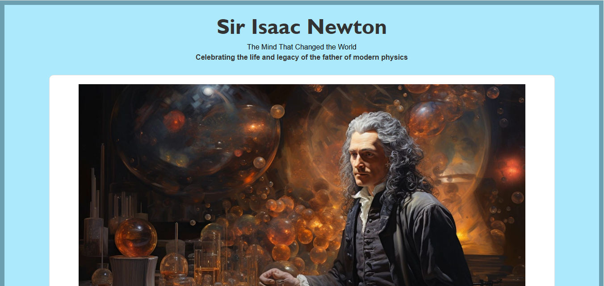
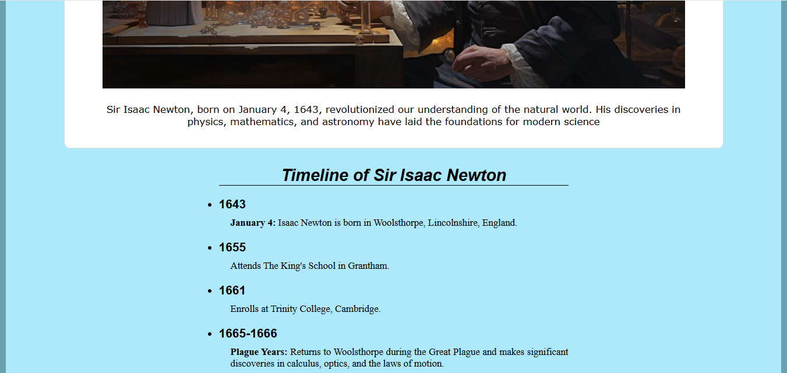
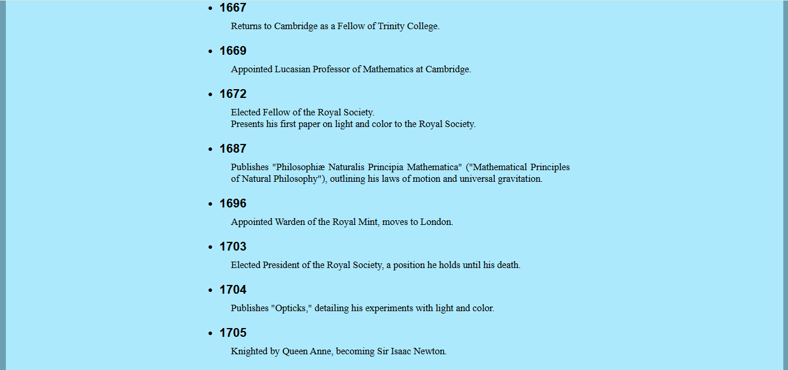
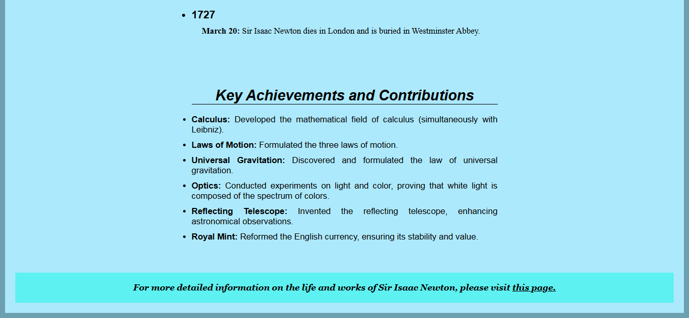

# Tribute Page - Sir Isaac Newton

This is a **Tribute Page** for **Sir Isaac Newton**, developed using **HTML and CSS** as part of a **FreeCodeCamp certification project**.

## Features
- **Responsive layout** for easy readability across different devices.
- **Timeline section** covering important milestones in Newton's life.
- **Key achievements** highlighting his major contributions.
- **A visually appealing tribute** with an image and captions.
- **A reference link** for further reading.

## Technologies Used
- **HTML** - For structuring the content.
- **CSS** - For styling the page layout and typography.

## Project Overview
This page includes:
- A **title and brief introduction** about Sir Isaac Newton.
- An **image section** with a caption.
- A **detailed timeline** of his life events.
- A **list of his key scientific contributions**.
- A **reference link** to an external biography page.

## Preview






## How to Use
1. Clone this repository:
   ```sh
   git clone https://github.com/Roshami/Tribute-Page.git
